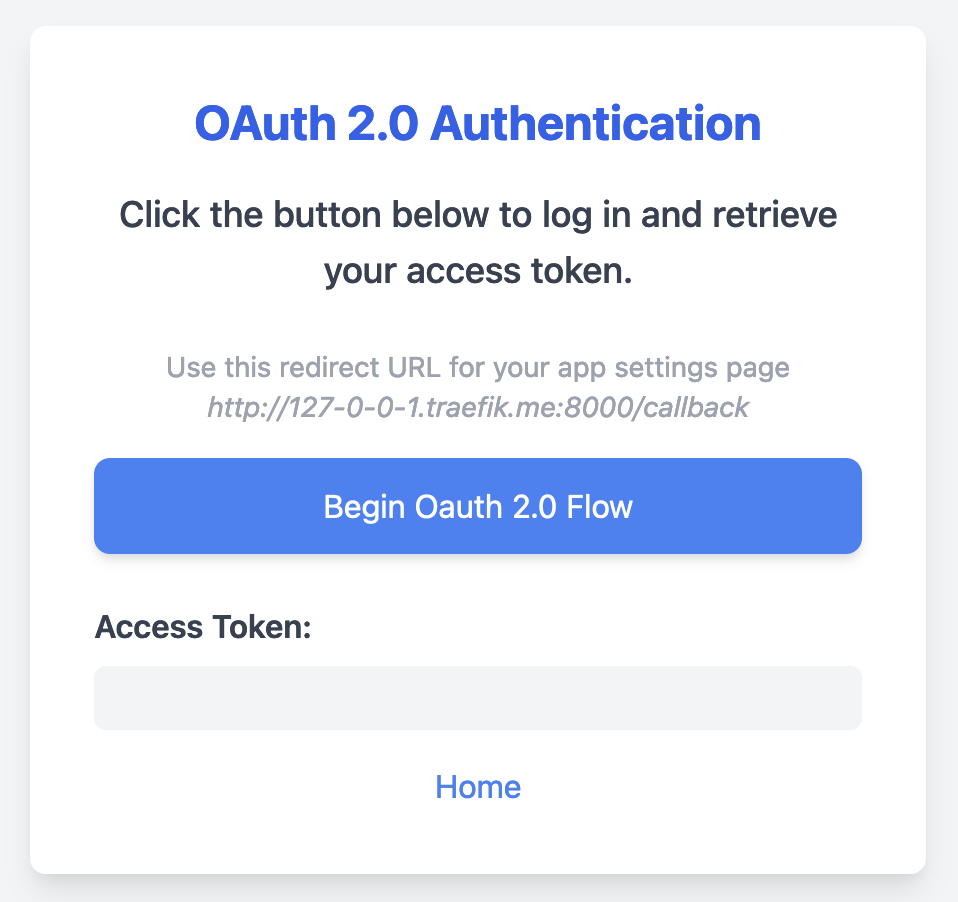

# OAuth 2.0 Flow

This repository contains a FastAPI application that performs OAuth 2.0 authentication.



## Functionality

The application provides a simple web interface for you to initiate the OAuth 2.0 flow.  Upon successful authentication, the application retrieves the access token and displays it in browser. For now, supports only `authorization_code` of grant type. This is anyways the most common one.

## Setup

1. **Install Dependencies:**
   ```bash
   pip install -r requirements.txt
   ```

2. **Set Environment Variables:** Create a `.env` file in the root directory and add the following environment variables:

    - `SERVER_PORT`: Set to 8000 for http, or 8443 for https. Of course, you can choose other values.
    - `CERT_PATH`: Optional, if using https for this server
    - `KEY_PATH`: Optional, if using https for this server
    - `CLIENT_ID`: Your App's Client ID.
    - `CLIENT_SECRET`: Your App's Client Secret.
    - `AUTHORIZATION_URL`: Provider's Authorization URL (URL to get `code`).
    - `TOKEN_URL`: Provider's Token URL (URL to get `access token`).
    - `REDIRECT_URL`: Redirect URI to be set in your App at provider's end (Fixed Value: `http://127-0-0-1.traefik.me:{SERVER_PORT}/callback`). Copy this value from frontend, or, after replacing `SERVER_PORT`

3. **Run the Application:**
   ```bash
   python server.py
   ```

   This will start the application on `http://127.0.0.1:8000`. But, preferabley, visit at [http://127-0-0-1.traefik.me:8000](http://127-0-0-1.traefik.me:8000). Change ports accordingly as set.
   
4. **HTTPS**
   
   Use `mkcert` tool to generate local root CA and certificates for localhost, if needed.

## Usage

1. Open your web browser and navigate to [http://127-0-0-1.traefik.me:8000](http://127-0-0-1.traefik.me:8000).
2. Click the "Begin Oauth 2.0 Flow" button.
3. You will be redirected to your provider's authorization page.
4. Log in to your provider's account and authorize the application.
5. You will be redirected back to the application, and your access token will be displayed.

## Notes

- Ensure that you have the necessary provider credentials and have configured the redirect URL correctly.

